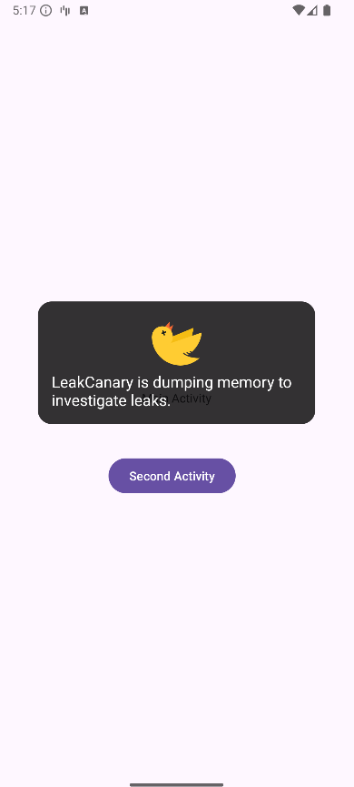
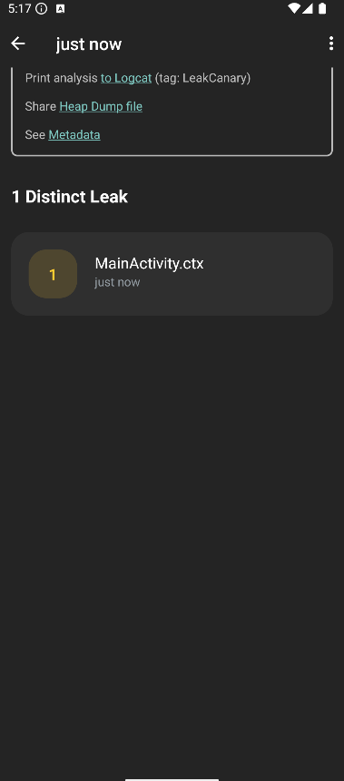
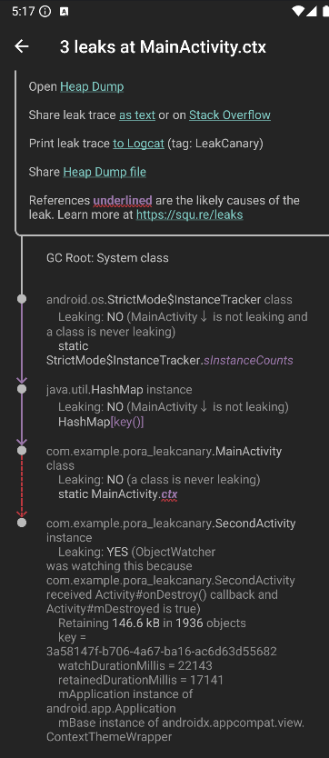
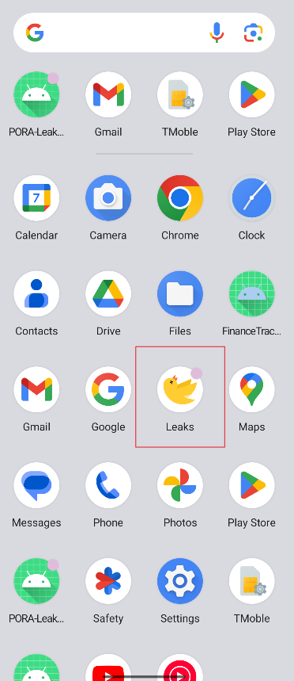
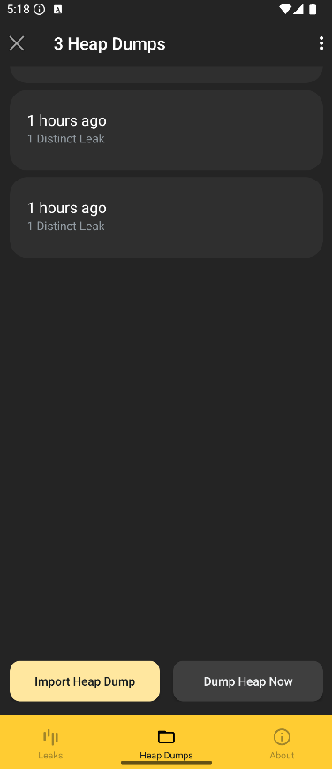

# 📚 Knjižnica LeakCanary

**LeakCanary** je knjižnica ki pomaga odkrivati in analizirati uhajanje pomnilnika (memory leaks) v aplikacijah. Razvila jo je ekipa pri Square, in je izjemno uporabna za razvijalce Android aplikacij, ki želijo izboljšati zmogljivost in stabilnost svojih aplikacij.

## 🤔 Zakaj izbrati LeakCanary?

- **Preprosta uporaba**: LeakCanary je enostavna za uporabo, saj zahteva le nekaj vrstic kode.
- **Hitro odkrivanje uhajanja pomnilnika**: LeakCanary samodejno zazna uhajanje pomnilnika in vam pošlje obvestilo.
- **Podrobne informacije**: LeakCanary vam ponuja podrobne informacije o uhajanju pomnilnika, kar vam pomaga hitro najti in odpraviti težavo.
- **Odprtokodna**: LeakCanary je odprtokodna knjižnica, kar pomeni, da jo lahko prilagodite svojim potrebam.

## 📜 Licenca - Apache License 2.0

1. **Svobodna uporaba in distribucija** 📂
    - Koda, licencirana pod Apache 2.0, se lahko uporablja za komercialne in nekomercialne namene brez omejitev.

2. **Spreminjanje in razširjanje** 🔄
    - Omogoča spreminjanje izvorne kode in distribucijo spremenjene ali nespremenjene različice, dokler je vključena kopija licence.

3. **Priznanje avtorstva** ✍️
    - V vseh izvodih ali večjih delih izvorne kode mora biti vključena opomba o avtorstvu, izvirni licenčni pogoji in obvestilo o morebitnih spremembah.

4. **Izključitev odgovornosti** ⚠️
    - Licenca ne zagotavlja nobenih garancij za delovanje programske opreme; razvijalci niso odgovorni za morebitne težave pri uporabi.

## 📊 Statistika in aktivnost

- [](Stevilo) **Zvezdice na GitHub-u:** ⭐ LeakCanary ima več kot **29.000 zvezdic** kar nam pove da je knjižnica zelo popularna.
- []() **Aktivni issue-ji:** 🐛 Trenutno je odprtih **97 aktivnih issue-jev**
- []() **Število forkov:** 🍴 Knjižnica ima dobrih 4000 forkov
- []() **Zadnji commit:** 🕒 Zadnji commit je bil narejen 29.08.2024

## ✅ Prednosti in ❌ slabosti

### ✅ Prednosti
- **Preprosta uporaba**: LeakCanary je preprosta za nastavitev in uporabo. Uporabnik jo mora le dodati v odvisnosti projekta.
- **Samodejna detekcija puščanja pomnilnika**: Samodejno zazna morebitna uhajanja pomnilnika in generira podrobna poročila, vključno s heap dumpi, ki so ključni za odpravljanje težav.
- **Vizualni prikaz in analize**: Ponuja jasen vizualni prikaz, ki pomaga razvijalcem hitro razumeti, kje v kodi prihaja do uhajanja pomnilnika.
- **Odprtokodna rešitev**: Ker je LeakCanary odprtokodna, ima skupnost možnost prispevati k njenemu razvoju, poleg tega pa je brezplačna za uporabo.

### ❌ Slabosti
- **Uporaba v produkcijskem okolju**:  LeakCanary ni zasnovan za uporabo v produkcijskem okolju, saj vpliva na delovanje aplikacije in poveča porabo pomnilnika.
- **Analiza heap dumpov je počasna**: Na večjih projektih ali pri zapletenih heap dumpih lahko analiza traja dolgo in lahko zahteva ročne posege za razumevanje določenih problemov.
- **Zahteva dodatne odvisnosti**:  Njegova integracija poveča velikost APK-ja, kar je lahko težava pri optimizaciji aplikacije.
- **Omejen obseg funkcionalnosti**: LeakCanary je specifično orodje za uhajanje pomnilnika in ne nudi širše diagnostike glede drugih težav z zmogljivostjo aplikacije.

## 🛠️ Primer uporabe

### Namestitev LeakCanary

1. Knjižnica se doda v datoteko `build.gradle` applikacije:

```gradle
dependencies {
  debugImplementation 'com.squareup.leakcanary:leakcanary-android:2.7'
}
```

2. Primer memory leak-a:

```kotlin
   companion object {
        lateinit var context: Context
   }
```

### Uporaba LeakCanary:

1. Zagon LeakCanary:


2. Čakanje na poročilo:



3. Pregled poročila:






### Aplikacija LeakCanary



#### Pregled preteklih poročil:



